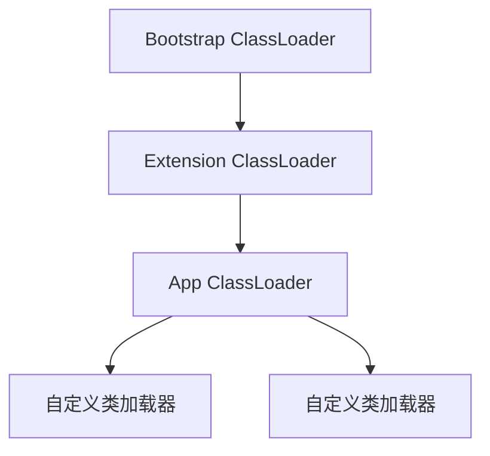

## GC
### 分代
> * Java虚拟机根据对象存活的周期不同，把堆内存划分为几块，一般分为新生代、老年代和永久代（对HotSpot虚拟机而言），这就是JVM的内存分代策略。
> * 堆内存是虚拟机管理的内存中最大的一块，也是垃圾回收最频繁的一块区域，我们程序所有的对象实例都存放在堆内存中
> * 新生代中的对象存活时间短，只需要在新生代区域中频繁进行GC，老年代中对象生命周期长，内存回收的频率相对较低，不需要频繁进行回收，永久代中回收效果太差，一般不进行垃圾回收
### 分代划分


#### 新生代（Young Generation） Minor GC
* HotSpot将新生代划分为三块，一块较大的Eden（伊甸）空间和两块较小的Survivor（幸存者）空间，默认比例为8：1：1。 划分的目的是因为HotSpot采用复制算法来回收新生代，设置这个比例是为了充分利用内存空间，减少浪费。新生成的对象在Eden区分配（大对象除外，大对象直接进入老年代），当Eden区没有足够的空间进行分配时，虚拟机将发起一次Minor GC
* 新生成的对象优先存放在新生代中，新生代对象朝生夕死，存活率很低，在新生代中，常规应用进行一次垃圾收集一般可以回收70% ~ 95% 的空间，回收效率很高。
* GC开始时，对象只会存在于Eden区和From Survivor区，To Survivor区是空的（作为保留区域）
* GC进行时，Eden区中所有存活的对象都会被复制到To Survivor区，而在From Survivor区中，仍存活的对象会根据它们的年龄值决定去向（默认为15）年龄值达到年龄阀值的对象会被移到老年代中，没有达到阀值的对象会被复制到To Survivor区。接着清空Eden区和From Survivor区，新生代中存活的对象都在To Survivor区。
#### 老年代（Old Generationn） Full GC
* 老年代中的对象生命周期较长，存活率比较高，在老年代中进行GC的频率相对而言较低，而且回收的速度也比较慢。
* 对象的大小大于Eden的二分之一会直接分配在old
#### 永久代（Permanent Generationn）
* 永久代存储类信息、常量、静态变量、即时编译器编译后的代码等数据对这一区域而言，Java虚拟机规范指出可以不进行垃圾收集，一般而言不会进行垃圾回收
* 1.8之后替换成了Metaspace（元空间 使用本地内存）
### 分代垃圾收集器分类
#### 次收集器Minor GC
* 发生在新生代的垃圾回收
* 当Eden空间不足以为对象分配内存时，会触发Scavenge GC，收集间隔较短
#### 全收集器Full GC
* 指发生在老年代的GC，出现了Full GC一般会伴随着至少一次的Minor GC，
* 当老年代或者用久代堆空间满了才会触发，收集间隔较长
* 可以使用System.gc()方法来显式的启动全收集
### 分代垃圾收集器（七个）
* 串行收集器（Serial）
* 并行收集器（ParNew）
* Parallel Scavenge收集器
* Serial Old收集器
* Parallel Old收集器
* CMS收集器（Concurrent Mark Sweep）
* 分区收集- G1收集器

### 垃圾回收算法（四个）
#### 引用计数（Reference Counting）
* 此对象有一个引用，即增加一个计数，删除一个引用则减少一个计数。
* 无法处理循环引用的问题
#### 复制（Copying） 
* 新生代Minor GC中使用
* 垃圾回收时，遍历当前使用区域，把正在使用中的对象复制到另外一个区域中
* 复制成本较小，但需要两倍内存空间
#### 标记-清除（Mark-Sweep）
* 老年代Full GC中使用
* 此算法执行分两阶段。第一阶段从引用根节点开始标记所有被引用的对象，第二阶段遍历整个堆，把未标记的对象清除
* 需要暂停应用，且会产生内存碎片
#### 标记-整理（Mark-Compact）
* 结合了“标记-清除”+“复制”
* 第一阶段从根节点开始标记所有被引用对象，第二阶段遍历整个堆，把清除未标记对象并且把存活对象“压缩”到堆的其中一块，按顺序排放

## JUC
* java.util.concurrent （实现线程安全包）
### JMM(java内存模型)
* 所有变量都存储在主内存，主内存是共享内存区域,所有线程都可访问,但线程对变量的操作(读取赋值等)必须在工作内存中进行,首先要将变量从主内存拷贝到自己的工作空间,然后对变量进行操作,操作完成再将变量写回主内存
* 可见性：线程操作变量 写回内存之后能够通知其他内存就是可见性
* 原子性：同时成功或者同时失败，n个线程同时去操作一个内存中的变量 最后变量的值要正确
* 有序性：编译器为了性能的优化，有时候会改变程序中语句的先后顺序，有序性指的是程序按照代码的先后顺序执行
* 


### Volatile
* 保证可见性、不保证原子性、禁止指令重排（指令重排：编译为了优化代码执行进行的顺序重排）
* 如何保证原子性：使用java.util.concurrent.atomic包下的AtomicInteger替换我们原本用的int等基本类型
* 如果是对象一类的要保证原子性则使用AtomicReference<Object>原子引用 
* 多线程下实现单例模式
```
/**
 * volatile防止指令重排
 * synchronized：保证原子性
 */
class Singleton{
    public static volatile Singleton singleton = null;

    public static Singleton getSingleton(){
        //双端检锁机制
        if(singleton == null){
            synchronized (Singleton.class){
                if(singleton == null){
                    singleton = new Singleton();
                }
            }
        }
        return singleton;
    }
}
```

### CAS（比较并交换）
* 如果线程的期望值和内存的真实值一样就更新数据，若线程的期望值和内存不一致本次修改失败 并重新拷贝内存中的值
* 核心类：UnSafe是操作底层的后门，类中所有的方法都是native修饰的,也就是说UnSafe类中的方法都是直接调用操作底层资源执行响应的任务
* UnSafe根据内存偏移值来获取最新的准确数据，这样即保证了并发的效率又确保原子性
* 缺点：加大CPU开销、只能保证一个共享变量的原子性、ABA问题（一个线程把数据A变为了B，然后又重新变成了A。此时另外一个线程读取的时候，发现A没有变化，就误以为是原来的那个A）
* ABA解决：增加版本号机制AtomicStampedReference<T>
* 自旋：UnSafe类 + CAS思想


### Synchronized
* 同步锁 保证方法或代码块在多线程下同步执行
* 即保证可见性 又保证原子性，但太重（无法保证并发的效率）

## 线程六种状态
* 初始：创建了一个线程对象，但还没有调用start()方法。
* 运行：Java线程中将就绪（ready）和运行中（running）两种状态笼统的称为“运行”
* 阻塞：表示线程阻塞于锁。
* 等待：进入该状态的线程需要等待其他线程做出一些特定动作（通知或中断）。
* 超时等待：该状态不同于WAITING，它可以在指定的时间后自行返回。
* 终止：表示该线程已经执行完毕。

### 公平锁和非公平锁
* 公平锁：是指多个线程按照申请锁的顺序来获取锁类似排队 先来后到
* 非公平锁：是指在多线程获取锁的顺序并不是按照申请锁的顺序,有可能后申请的线程比先申请的线程优先获取到锁,在高并发的情况下,有可能造成优先级反转或者饥饿现象（如果获取失败会到公平锁的队列中）
* 并发包ReentrantLock的创建可以指定构造函数的boolean类型来得到公平锁或者非公平锁 默认是非公平锁

### 可重入锁（递归锁）
* 线程可以进入任何一个它已经拥有的锁所同步者的代码块（指的是同一线程外层函数获得最外层锁之后，内层递归函数仍然能获取该锁的代码；获取大门钥匙后可以进入房间）
* 最大作用就是避免死锁
* synchronized/lock都是典型可重入锁

### 自旋锁
* 是指尝试获取锁的线程不会立即阻塞，而是采用循环的方式去尝试获得锁，这样的好处是减少线程上下文切换 缺点循环会消耗CPU性能
* AtomicInteger
```
    public final int getAndAddInt(Object var1, long var2, int var4) {
        int var5;
        do {
            var5 = this.getIntVolatile(var1, var2);
        } while(!this.compareAndSwapInt(var1, var2, var5, var5 + var4));
        return var5;
    }
```

### 独占锁(写)/共享锁(读)/互斥锁(读写)
* 独占锁：指该锁一次只能被一个线程拥有（ReentrantLock/Synchronized都是）
* 共享锁：指该锁可以被多个线程共享
* 互斥锁：是一种简单的加锁的方法来控制对共享资源的访问，互斥锁只有两种状态,即上锁( lock )和解锁( unlock )，读写即是互斥的

### CountDownLatch
* 让一些线程阻塞直到另外的一些操作完成后才被唤醒
* 两个方法：countDown()计数器减一，当计时器值为0调用await()方法会唤醒阻塞的线程
```
        CountDownLatch countDownLatch = new CountDownLatch(6);//阻塞
        for (int i = 1; i <= 6; i++) {
            new Thread(() -> {
                System.out.println(Thread.currentThread().getName() + "\t" + "国,灭亡");
                countDownLatch.countDown();//自减
            }, String.valueOf(i)).start();
        }
        countDownLatch.await();//唤醒
        System.out.println("秦统一");
```

### CyclicBarrier 
* 让一组线程到达屏障时被阻塞，直到最后一个线程到达屏障时才会开门，这时所有线程才会被唤醒继续工作
* countDownLatch(火箭倒计时自减)，CyclicBarrier(计数器 等大家到齐)
```
        CyclicBarrier cyclicBarrier = new CyclicBarrier(7, ()->{ System.out.println("召唤神龙！"); });

        for (int i = 0; i < 7; i++) {
            new Thread(() -> {
                System.out.println(Thread.currentThread().getName() + "---龙珠");
                try {cyclicBarrier.await();} catch (InterruptedException e) {e.printStackTrace();} catch (BrokenBarrierException e) {e.printStackTrace();}
            }, String.valueOf(i)).start();
        }
```

### Semaphore
* 是一个计数信号量，必须由获取它的线程释放，常用于限制可以访问某些资源的线程数量
* 可伸缩的控制并发资源数（初始化、减少、增加）
```
        Semaphore semaphore = new Semaphore(3);//3个车位
        for (int i = 0; i < 6; i++) {//六辆车
            new Thread(() -> {
                try {
                    semaphore.acquire();//锁定资源
                    System.out.println(Thread.currentThread().getName() + "抢到车位！");
                    try {TimeUnit.SECONDS.sleep(3);} catch (InterruptedException e) {e.printStackTrace();}
                    System.out.println(Thread.currentThread().getName() + "停车3秒后 还回车位！");
                } catch (InterruptedException e) {
                    e.printStackTrace();
                }finally {
                    semaphore.release();//还回资源
                }
            }, String.valueOf(i)).start();
        }
```

## 阻塞队列 (BlockingQueue)
* 当阻塞队列是空的时候，从队列中`获取`元素会被阻塞；当阻塞队列是满的时候，从队列中`添加`元素会被阻塞
### ArrayBlockingQueue 
* 由数组构成的有界阻塞队列

### LinkedBlockingQueue
* 由链表结构组成的有界阻塞队列（但大小是默认值Integer.MAX_VALUE）


### SynchroousQueue
* 不储存元素的阻塞队列，也是单个的元素队列（SynchronousQueue没有容量）
* 每个put操作必须要等待一个take操作,否则不能继续添加元素,反之亦然
```
        BlockingQueue<String> blockingQuery = new SynchronousQueue<>();
        new Thread(() -> {
            try {
                blockingQuery.put("aaa");
                System.out.println("put aaa success");
                blockingQuery.put("bbb");
                System.out.println("put bbb success");
                blockingQuery.put("ccc");
                System.out.println("put bbb success");
            } catch (InterruptedException e) {
                e.printStackTrace();
            }
        },"rng").start();

        new Thread(() -> {
            try {
                System.out.println(Thread.currentThread().getName() + "取出：" + blockingQuery.take());
                TimeUnit.SECONDS.sleep(5);
                System.out.println(Thread.currentThread().getName() + "取出：" + blockingQuery.take());
                TimeUnit.SECONDS.sleep(5);
                System.out.println(Thread.currentThread().getName() + "取出：" + blockingQuery.take());
                TimeUnit.SECONDS.sleep(5);
            } catch (InterruptedException e) {
                e.printStackTrace();
            }
        },"ig").start();
```
## 线程代码编写口诀
* 线程  操作  资源类
* 判断  干活  通知
* 防止虚假唤醒机制

### 阻塞队列one
* synchronized：线程阻塞
* wait：线程等待
* notify：唤醒线程
* 传统方式实现线程通信之生产者消费者：一个初始值为0的变量 两个线程交替操作 一个加1 一个减1重复五次
```
class Kitchen0{
    private Integer food = 0;

    public synchronized void increase() {
        try {
            while (food != 0){
                this.wait();//线程等待
            }
            food ++;
            System.out.println(Thread.currentThread().getName() + "\t老版本生产了一个食物，当前：" + food);
            this.notifyAll();
        }catch (Exception e){
            e.printStackTrace();
        }
    }

    public synchronized void dncrease(){
        try {
            while (food == 0){
                this.wait();//线程等待
            }
            food --;
            System.out.println(Thread.currentThread().getName() + "\t老版本消费了一个食物，当前：" + food);
            this.notifyAll();
        }catch (Exception e){
            e.printStackTrace();
        }
    }
}


public class zero {

    public static void main(String[] args) {
        Kitchen0 kitchen = new Kitchen0();
        new Thread(() -> {
            for (int i = 0; i <=5; i++) {
                kitchen.increase();
            }
        },"rng").start();

        new Thread(() -> {
            for (int i = 0; i <=5; i++) {
                kitchen.dncrease();
            }
        },"ig").start();
    }
}
```

### 阻塞队列two（）
* Lock：线程阻塞
* Condition.await：线程等待
* Condition.signal：唤醒线程
* 传统方式实现线程通信之生产者消费者：一个初始值为0的变量 两个线程交替操作 一个加1 一个减1重复五次
```
class Kitchen{
    private Integer food = 0;
    Lock lock = new ReentrantLock();//初始化锁
    Condition condition  = lock.newCondition();

    public void increase() {
        lock.lock();//上锁
        try {
            while (food != 0){
                condition.await();//线程等待
            }
            food ++;
            System.out.println(Thread.currentThread().getName() + "\t生产了一个食物，当前：" + food);
            condition.signalAll();//唤醒所有线程
        }catch (Exception e){
            e.printStackTrace();
        }finally {
            lock.unlock();//解锁
        }
    }

    public void dncrease(){
        lock.lock();
        try {
            while (food == 0){
                condition.await();//线程等待
            }
            food --;
            System.out.println(Thread.currentThread().getName() + "\t消费了一个食物，当前：" + food);
            condition.signalAll();
        }catch (Exception e){
            e.printStackTrace();
        }finally {
            lock.unlock();
        }
    }
}


public class one {

    public static void main(String[] args) {
        Kitchen kitchen = new Kitchen();
        new Thread(() -> {
            for (int i = 0; i <=5; i++) {
                kitchen.increase();
            }
        },"rng").start();

        new Thread(() -> {
            for (int i = 0; i <=5; i++) {
                kitchen.dncrease();
            }
        },"ig").start();
    }
}
```

### 阻塞队列three
* 消息队列底层原理
```
/**
 * 3.0版本的阻塞队列
 * Volatile/CAS/AtomicInteger/AtomicReference/BlockingQueue
 * 实现MQ底层
 * @author langao_q
 * @create 2020-04-18 21:45
 */
class Source{
    private volatile boolean FLAG = true;
    private AtomicInteger atomicInteger = new AtomicInteger();//初始值为0

    private BlockingQueue<String> blockingQueue = null;
    public Source(BlockingQueue blockingQueue){
        System.out.println("传进来的BlockingQueue是：" + blockingQueue.getClass().getName());
        this.blockingQueue = blockingQueue;
    }

    //生产方法
    public void prod() throws InterruptedException {
        String data = null;
        while (FLAG){
            data = atomicInteger.incrementAndGet() + "";
            boolean rest = blockingQueue.offer(data, 2L, TimeUnit.SECONDS);//把生产的数据放入队列
            if(rest)
                System.out.println(Thread.currentThread().getName() + "\t生产了数据：" + data);
            else
                System.out.println(Thread.currentThread().getName() + "\t生产数据失败！：" + data);
            TimeUnit.SECONDS.sleep(1);
        }
        System.out.println(Thread.currentThread().getName() + "\t停止生产数据");
    }

    //消费方法
    public void consum() throws InterruptedException {
        String data = null;
        while (FLAG){
            data = blockingQueue.poll(2L, TimeUnit.SECONDS);//从队列中取出生产数据
            if(data == null || data.equalsIgnoreCase("")){
                FLAG = false;
                System.out.println(Thread.currentThread().getName() + "\t超时退出！");
                return;
            }
            System.out.println(Thread.currentThread().getName() + "\t消费了数据：" + data);
        }
    }

    //暂停方法
    public void stop(){
        FLAG = false;
        System.out.println("停止生产和消费数据！");
    }
}
public class three {
    public static void main(String[] args) throws InterruptedException {
        Source s = new Source(new ArrayBlockingQueue(10));
        new Thread(() -> {//生产线程
            try {s.prod();} catch (InterruptedException e) {e.printStackTrace();}
        },"rng").start();
        new Thread(() -> {//消费线程
            try {s.consum();} catch (InterruptedException e) {e.printStackTrace();}
        },"ig").start();

        TimeUnit.SECONDS.sleep(10);//main线程休息10s 让前面两个线程操作
        s.stop();//停止生产和消费
    }
}
```

### Callable（第三种实现多线程方式）
* 区别：相对与Runnable有返回值、能够抛出异常
* 启动方式：通过FutureTask
* 注意：尽量最后get()获取返回值（如果计算返回值需要时间 main线程会阻塞等待 直到计算完成）
* 
```
class mythread implements Callable<Integer>{
    @Override
    public Integer call() throws Exception {
        System.out.println(Thread.currentThread().getName() + "\t 开启一个单独的线程");
        TimeUnit.SECONDS.sleep(3);
        return 1024;
    }
}

public class CallableDemo {
    public static void main(String[] args) throws ExecutionException, InterruptedException {
        FutureTask<Integer> futureTask = new FutureTask<>(new mythread());//1.构造线程
        new Thread(futureTask, "IG").start();//2.启动线程
        Integer value = futureTask.get();//3.获取返回值（尽量往后放）
        System.out.println("Callable实现多线程的返回值：" + value);
    }
}
```

## 线程池
* 主要用来控制运行的线程的数量，处理过程中将线程放入队列，如果线程数量超出了队列数量 则需要排队等候等其他线程执行完毕再取出线程来执行
* 优点：线程复用；控制最大并发数；管理线程（底层是阻塞队列）

### ThreadPoolExecutor（第四种实现多线程）
* Executors.newCachedThreadPool() 
创建一个根据需要创建新线程的线程池，但在可用时将重新使用以前构造的线程。
* Executors.newFixedThreadPool(int nThreads)
创建一个线程池，该线程池重用固定数量的从共享无界队列中运行的线程。 
* Executors.newFixedThreadPool()
创建一个使用从无界队列运行的单个工作线程的执行程序
* 开启/停止命令
```
executorService.execute();
executorService.shutdown();
```

### 线程池七大参数


### Synchronized和Lock的区别
* Sync是关键字属于JVM层面，Lock是具体类属于Api层面
* Sync不需要手动释放锁，Lock需要手动释放锁 否则产生死锁
* Sync不可中断，Lock可以中断 相对Sync更加灵活
* Sync是非公平锁，Lock两者都可以 
* Lock有锁绑定多个条件Condition Sync没有（sync只能是唤醒所有或者唤醒一个 Lock可以精确唤醒）


### ThreadLocal的了解，实现原理。
每个线程都保存一份threadlocalmap的引用,以ThreadLocal和 ThreadLocal对象声明的变量类型作为参数


## JVM
### 双亲委派模式

*  某个特定的类加载器在接到加载类的请求时，首先将加载任务委托给父类加载器，依次递归，如果父类加载器可以完成类加载任务，就成功返回；只有父类加载器无法完成此加载任务时，才自己去加载。
* 避免重复加载 + 避免核心类篡改

#### JVM内存结构
* 堆：存放所有new出来的对象（管运行）
* 虚拟机栈：存放基本数据类型、局部变量、对象的引用（管储存）
* 本地方法栈：
* 程序计数器：
* 方法区：


## 类的初始化
* 父类静态代码块 > 子类静态代码块 > 父类普通变量及其语句块 > 父类构造方法 > 子类普通变量及其语句块 > 子类构造方法